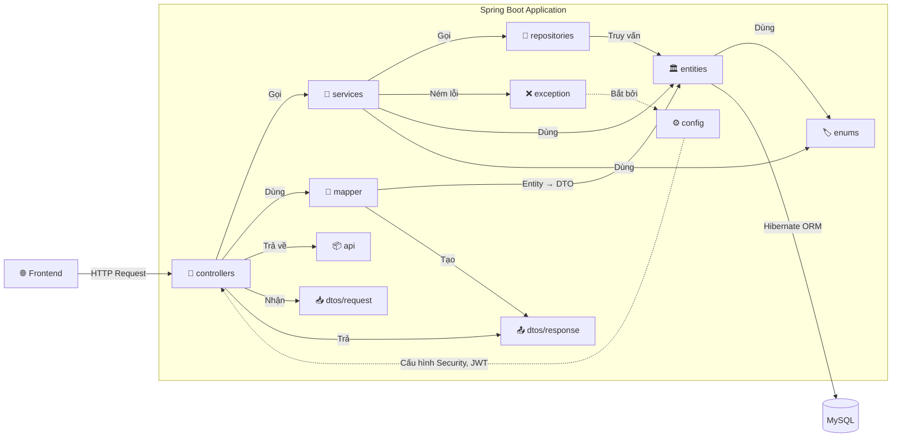
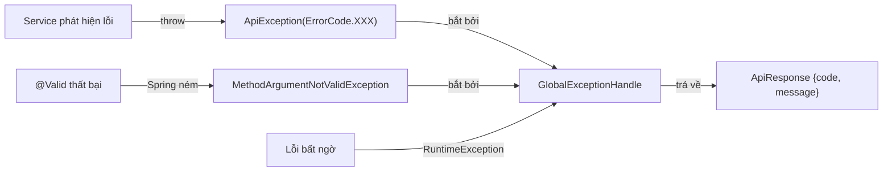
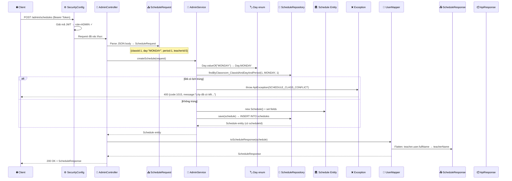

# 🔗 PHÂN TÍCH MỐI QUAN HỆ GIỮA CÁC PACKAGE BACKEND

---

## 1. SƠ ĐỒ TỔNG QUAN — AI GỌI AI?



---

## 2. GIẢI THÍCH TỪNG PACKAGE — VAI TRÒ & TRÁCH NHIỆM

### 📦 `api/` — Wrapper Response chuẩn

**File:** `ApiResponse.java` (20 dòng)

**Vai trò:** Định dạng **"phong bì"** thống nhất cho mọi API response.

```java
public class ApiResponse<T> {
    int code = 1000;    // 1000 = thành công, khác = lỗi
    String message;      // null khi thành công, mô tả lỗi khi fail
    T data;              // Dữ liệu thực tế (generic type)
}
```

**Ai dùng nó?** → `Controller` bọc kết quả trước khi trả về client:
```java
return ApiResponse.<String>builder().data("Xóa thành công").build();
```

**Tại sao cần?** → Frontend chỉ cần check `response.data.code` để biết thành công hay lỗi, không phụ thuộc HTTP status code.

---

### ⚙️ `config/` — Cấu hình hệ thống

**3 file:**

| File | Vai trò |
|:---|:---|
| `SecurityConfig.java` | Chuỗi lọc bảo mật: CORS, JWT decoder, phân quyền endpoint |
| `JwtProperties.java` | Đọc `signer-key`, `access-token-expiration-ms` từ `application.yml` |
| `ApplicationInitConfig.java` | Tự tạo tài khoản `admin/admin` khi app khởi động lần đầu |

**Ai dùng nó?** → Spring Boot tự load khi khởi động. `SecurityConfig` can thiệp **trước mọi request** (filter chain).

**Quan hệ:**
- `SecurityConfig` dùng `JwtProperties.signerKey` để tạo `JwtDecoder`
- `SecurityConfig` quyết định endpoint nào public, endpoint nào cần role nào
- `ApplicationInitConfig` dùng `PasswordEncoder` (bean từ SecurityConfig) + `UserRepository`

---

### 🎯 `controllers/` — Cổng vào API

**5 controllers, ~40 endpoints tổng cộng**

**Vai trò:** Nhận HTTP request → validate → gọi Service → dùng Mapper chuyển Entity sang DTO → trả response.

**Quy tắc quan trọng:** Controller **KHÔNG chứa logic nghiệp vụ** — chỉ là "người giao nhận".

**Ví dụ luồng tạo Schedule:**
```
1. Client: POST /admin/schedules {classId, day, period, ...}
2. Controller nhận ScheduleRequest (DTO) → validate @Valid
3. Controller gọi adminService.createSchedule(request)
4. Service xử lý logic (check trùng, tạo entity, lưu DB)
5. Service trả về Schedule entity
6. Controller gọi userMapper.toScheduleResponse(schedule)
7. Mapper chuyển Schedule entity → ScheduleResponse (DTO)
8. Controller trả ScheduleResponse cho client
```

**Quan hệ:**
- **Dùng:** `Service` (gọi logic), `Mapper` (chuyển đổi), `ApiResponse` (bọc kết quả)
- **Nhận:** `dtos/request` (từ client)
- **Trả:** `dtos/response` (cho client)

---

### 📥📤 `dtos/` — Vỏ bọc dữ liệu

**2 thư mục con:** `request/` (10 DTO) và `response/` (9 DTO)

**Vai trò:** Lớp bảo vệ giữa API và Database.

| Loại | Hướng | Ví dụ | Tại sao cần |
|:---|:---|:---|:---|
| **Request DTO** | Client → Server | `ScheduleRequest{classId, day, period}` | Chỉ nhận đúng fields cho phép, validate bằng `@Valid` |
| **Response DTO** | Server → Client | `ScheduleResponse{teacherName, classroomName}` | Chỉ trả fields cần thiết, flatten data, ẩn `passwordHash` |

**So sánh Request vs Entity vs Response:**
```
ScheduleRequest (client gửi):     {classId: 1, teacherId: 5, day: "MONDAY", period: 1}
Schedule Entity (trong DB):        {scheduleId: 99, day: MONDAY, period: 1, classroom: {Classroom obj}, teacher: {Teacher obj}}
ScheduleResponse (trả client):    {scheduleId: 99, dayOfWeek: "MONDAY", period: 1, teacherName: "Nguyễn Văn A", classroomName: "10A1"}
```

→ Client **không cần biết** cấu trúc DB phức tạp, chỉ nhận data đã "làm phẳng".

---

### 🏛️ `entities/` — Bản đồ Database

**11 file** — mỗi file = 1 class Java ánh xạ 1 bảng MySQL qua JPA annotations.

**Vai trò:** Là **"bản sao Java"** của các bảng trong CSDL.

**Quan hệ giữa các Entity (phản ánh FK trong DB):**
```
User ←──1:1──→ Student (qua @MapsId, chia sẻ PK)
User ←──1:1──→ Teacher (qua @MapsId, chia sẻ PK)
User ←──1:N──→ UserRole ←──N:1──→ Role
Student ←──N:1──→ Classroom
Classroom ←──1:1──→ Teacher (GVCN)
Classroom ←──1:N──→ ClassSubjectTeacher ←──N:1──→ Subject, Teacher
Classroom ←──1:N──→ Schedule ←──N:1──→ Subject, Teacher
Student ←──1:N──→ Grade ←──N:1──→ Subject, Teacher
```

**Ai dùng nó?**
- `Repository` truy vấn/lưu Entity
- `Service` thao tác logic trên Entity
- `Mapper` đọc Entity để tạo DTO Response

---

### 🏷️ `enums/` — Hằng số hệ thống

**3 enum:**

| Enum | Giá trị | Dùng ở đâu |
|:---|:---|:---|
| `Roles` | `ADMIN, TEACHER, STUDENT` | Entity `Role`, `AuthenticationService` |
| `Gender` | `MALE, FEMALE, OTHER` | Entity `Student`, `Teacher` |
| `Day` | `MONDAY → SATURDAY` | Entity `Schedule`, `AdminService` |

**Tại sao dùng Enum?** → Type-safe, IDE gợi ý, không bao giờ nhập sai (so với dùng String/int).

---

### ❌ `exception/` — Xử lý lỗi tập trung

**3 file hoạt động cùng nhau:**



**Luồng chi tiết:**
1. Service gặp lỗi → `throw new ApiException(ErrorCode.STUDENT_NOT_FOUND)`
2. `ApiException` chứa `ErrorCode` enum (code=1005, message="Student not found")
3. `GlobalExceptionHandle` (@ControllerAdvice) **tự động bắt** mọi exception
4. Trả `400 Bad Request` + `{code: 1005, message: "Student not found"}`
5. Frontend đọc `response.data.message` để hiển thị lỗi cho user

---

### 🔄 `mapper/` — Nhà máy chuyển đổi

**1 file:** `UserMapper.java` — MapStruct interface với **12 mapping methods**.

**Vai trò:** Chuyển đổi **tự động** giữa Entity ↔ DTO.

**Ví dụ phức tạp nhất — Schedule mapping:**
```java
@Mapping(target = "teacherName", expression = "java(
    schedule.getTeacher() != null 
      ? (schedule.getTeacher().getUser().getFullName() != null 
          ? schedule.getTeacher().getUser().getFullName() 
          : schedule.getTeacher().getUser().getUsername()) 
      : null
)")
ScheduleResponse toScheduleResponse(Schedule schedule);
```

→ Từ `Schedule.teacher.user.fullName` (3 cấp nested) → flatten thành `ScheduleResponse.teacherName`.

**Ai gọi Mapper?** → **Controller** gọi sau khi Service trả Entity:
```java
// Trong AdminController:
return userMapper.toScheduleResponse(adminService.createSchedule(request));
```

---

### 💾 `repositories/` — Cổng vào Database

**10 interfaces** kế thừa `JpaRepository<Entity, ID>`.

**Vai trò:** Khai báo **method signature** → Spring Data JPA **tự sinh SQL**.

**Ví dụ cách Spring hiểu method name:**
```java
findByStudent_IdAndSubject_SubjectId(Long studentId, Long subjectId)
// Spring tự sinh:
// SELECT * FROM grades WHERE student_id = ? AND subject_id = ?

findByClassroom_ClassIdAndDayAndPeriod(Long classId, Day day, Integer period)
// Spring tự sinh:
// SELECT * FROM schedules WHERE class_id = ? AND day = ? AND period = ?
```

**Ai gọi Repository?** → **Service** gọi để đọc/ghi dữ liệu.

---

### 🧠 `services/` — Bộ não nghiệp vụ

**4 nhóm service** (mỗi nhóm có Interface + Implementation):

| Service | Số methods | Nghiệp vụ chính |
|:---|:---|:---|
| `AuthenticationService` | 5 | Login, Register, Refresh Token, Change Password |
| `AdminService` | 26 | CRUD toàn bộ (User, Student, Teacher, Classroom, Subject, Schedule) |
| `TeacherService` | 9 | Profile, lớp dạy, nhập điểm batch, lớp chủ nhiệm |
| `StudentService` | 5 | Profile, xem điểm, xem TKB |

**Vai trò:** Chứa **100% logic nghiệp vụ** — kiểm tra xung đột, phân quyền, upsert, validate.

---

## 3. LUỒNG DỮ LIỆU HOÀN CHỈNH — VÍ DỤ: TẠO LỊCH HỌC



---

## 4. CÂU HỎI BỔ SUNG (35 → 55)

### 🔗 NHÓM 8: QUAN HỆ GIỮA CÁC PACKAGE

---

#### ❓ Câu 35: "Controller có được gọi trực tiếp Repository không?"

> **Không.** Controller chỉ gọi Service, Service gọi Repository. Nếu Controller gọi thẳng Repository sẽ **vi phạm Separation of Concerns** — logic nghiệp vụ bị phân tán, khó maintain. Ví dụ: nếu tạo Schedule cần kiểm tra xung đột, logic đó phải nằm ở Service, không phải Controller.

---

#### ❓ Câu 36: "Tại sao Service có Interface (VD: AdminServiceImp) + Implementation (AdminService)?"

> Tuân theo **nguyên tắc Dependency Inversion (SOLID-D)**: Controller phụ thuộc vào Interface, không phụ thuộc vào Implementation cụ thể.
> - Dễ thay thế: có thể viết `AdminServiceMock` cho testing mà không cần sửa Controller
> - Spring Boot dùng interface để tạo Proxy (hỗ trợ `@Transactional`, AOP)
>
> *Lưu ý: Tên `AdminServiceImp` trong dự án thực ra là Interface — naming convention hơi ngược so với chuẩn (thường Interface là `AdminService`, Implementation là `AdminServiceImpl`).*

---

#### ❓ Câu 37: "ApiResponse khác gì với DTO Response?"

> Hai vai trò hoàn toàn khác nhau:
> - **DTO Response** (VD: `ScheduleResponse`): mang **dữ liệu nghiệp vụ** (tên lớp, tên GV, tiết...)
> - **ApiResponse**: là **phong bì** bọc bên ngoài, chứa `{code, message, data}`
>
> Kết quả cuối cùng client nhận:
> ```json
> { "code": 1000, "data": { "scheduleId": 1, "teacherName": "Nguyễn A", ... } }
> ```
> `ApiResponse.data` chính là `ScheduleResponse`.

---

#### ❓ Câu 38: "Entity có biết đến DTO không? DTO có biết đến Entity không?"

> **Không theo cả 2 chiều.** Entity và DTO hoàn toàn **độc lập** — không import lẫn nhau. Mapper là cầu nối duy nhất giữa chúng. Đây là thiết kế **Loose Coupling** — thay đổi DTO không ảnh hưởng Entity và ngược lại.

---

#### ❓ Câu 39: "Enum được lưu trong DB như thế nào?"

> Mặc định Hibernate lưu Enum theo **ordinal** (số thứ tự: MONDAY=0, TUESDAY=1...). Có thể thêm `@Enumerated(EnumType.STRING)` để lưu dạng text ("MONDAY"). Trong dự án, `Day` và `Gender` được lưu dạng số (`TINYINT`), `Roles` được lưu dạng tên (`VARCHAR`) trong bảng `roles`.

---

#### ❓ Câu 40: "GlobalExceptionHandle hoạt động ở tầng nào?"

> Hoạt động ở **tầng Controller** — nhờ annotation `@ControllerAdvice`. Spring tự động bắt mọi exception ném từ Controller/Service trước khi trả về client. Nó giống như một **try-catch toàn cục** cho tất cả API endpoints.

---

#### ❓ Câu 41: "Mapper nằm ở đâu trong luồng request?"

> Mapper nằm ở **ranh giới Controller ↔ Service**:
> - **Request:** Controller nhận DTO → có thể dùng Mapper chuyển sang Entity (VD: `toUser(RegisterRequest)`) → truyền cho Service
> - **Response:** Service trả Entity → Controller dùng Mapper chuyển sang DTO (VD: `toScheduleResponse(schedule)`) → trả client
>
> Mapper **không** được gọi trong Service — giữ Service thuần túy làm việc với Entity.

---

#### ❓ Câu 42: "Tại sao config tách riêng JwtProperties thay vì hardcode?"

> Tuân theo **nguyên tắc Externalized Configuration** của Spring Boot:
> - Secret key, thời hạn token nằm trong `application.yml` → thay đổi không cần rebuild
> - Mỗi môi trường (dev/staging/prod) có file config riêng
> - `@ConfigurationProperties(prefix = "jwt")` tự map YAML → Java object, an toàn hơn `@Value`

---

### 🧩 NHÓM 9: CÂU HỎI VỀ SPRING FRAMEWORK

---

#### ❓ Câu 43: "Dependency Injection là gì? Dự án dùng ở đâu?"

> DI = Spring tự tạo và tiêm (inject) các object vào nơi cần dùng, thay vì `new` thủ công.
>
> Dự án dùng **Constructor Injection** qua `@RequiredArgsConstructor` (Lombok):
> ```java
> @RequiredArgsConstructor  // Lombok sinh constructor
> public class AdminController {
>     AdminServiceImp adminService;  // Spring tự inject
>     UserMapper userMapper;         // Spring tự inject
> }
> ```
> Ưu điểm: immutable (final), dễ test (truyền mock qua constructor).

---

#### ❓ Câu 44: "@Transactional hoạt động thế nào?"

> Spring tạo **Proxy** bọc ngoài Service. Khi gọi method có `@Transactional`:
> 1. Proxy mở transaction (`BEGIN`)
> 2. Thực thi method
> 3. Không lỗi → `COMMIT` | Có lỗi → `ROLLBACK`
>
> `@Transactional(readOnly = true)` ở class-level → mặc định tất cả method chỉ đọc (tắt dirty-checking). Method cần ghi phải override `@Transactional` (không readOnly).

---

#### ❓ Câu 45: "Spring Data JPA tự sinh SQL như thế nào?"

> Spring phân tích **tên method** theo quy ước:
> ```
> findByStudent_IdAndSubject_SubjectId(Long sid, Long subId)
>   ↓ parse
> find + By + Student_Id + And + Subject_SubjectId
>   ↓ sinh SQL
> SELECT * FROM grades WHERE student_id = ? AND subject_id = ?
> ```
> Quy tắc: `findBy` + tên property (dấu `_` = navigate relation) + `And/Or` + tên property tiếp.

---

### 🔧 NHÓM 10: CÂU HỎI TÌNH HUỐNG

---

#### ❓ Câu 46: "GV nhập điểm cho HS không thuộc lớp mình dạy — xử lý thế nào?"

> `TeacherService.inputGrades()` kiểm tra **3 lớp**:
> 1. `checkTeachingClass()` → GV có dạy lớp này không? (qua class_subjects hoặc schedules)
> 2. `studentRepository.findById()` → HS có tồn tại không?
> 3. `student.getClassroom().getClassId().equals(classId)` → HS có thuộc lớp này không?
> → Nếu vi phạm bất kỳ bước nào → `ApiException` → 400 Bad Request.

---

#### ❓ Câu 47: "2 GV cùng dạy 1 tiết ở 2 lớp khác nhau — được không?"

> **Không.** `AdminService.createSchedule()` kiểm tra `findByTeacher_IdAndDayAndPeriod()` — nếu GV đã có lịch vào (ngày, tiết) đó ở **bất kỳ lớp nào** → ném `SCHEDULE_TEACHER_CONFLICT`. Một GV chỉ được dạy 1 lớp tại 1 thời điểm.

---

#### ❓ Câu 48: "HS chưa được gán lớp, xem TKB sẽ thế nào?"

> `StudentService.getSchedule()` kiểm tra `student.getClassroom() == null` → ném `ApiException(STUDENT_NO_CLASS)`. Frontend nhận lỗi và hiển thị thông báo "Bạn chưa được phân lớp". HS phải đợi Admin gán lớp trước.

---

#### ❓ Câu 49: "Giải thích checkTeachingClass() kiểm tra quyền GV?"

> Kiểm tra GV có liên quan đến lớp qua **3 nguồn**:
> 1. **Lớp chủ nhiệm**: `teacher.getClassroom().getClassId() == classId`
> 2. **Phân công môn**: duyệt `teacher.getClassSubjects()` xem có entry nào .classroom = classId
> 3. **Lịch dạy**: duyệt `teacher.getSchedules()` xem có tiết nào ở classId
>
> → Nếu cả 3 đều không → `NOT_TEACHING_CLASS` (1009).

---

#### ❓ Câu 50: "Tại sao đăng nhập hỗ trợ cả username, mã HS, mã GV?"

> Vì trong trường học thực tế, HS/GV thường nhớ **mã** của mình hơn username. `AuthenticationService.login()` thử tuần tự:
> 1. `repo.findByUsername()` → tìm theo username
> 2. Không thấy → `studentRepository.findByStudentCode()` → tìm theo mã HS (STUxxx)
> 3. Vẫn không → `teacherRepository.findByTeacherCode()` → tìm theo mã GV (TCHxxx)
> 4. Đều không → `USER_NOT_FOUND`

---

#### ❓ Câu 51: "Khi nào dùng @EntityGraph, khi nào không?"

> Dùng `@EntityGraph` khi biết **chắc chắn sẽ cần** dữ liệu quan hệ trong response. Ví dụ:
> - `findByClassroom_ClassId()` trong ScheduleRepo → cần teacher name, subject name → **dùng**
> - `findById()` (get 1 entity đơn lẻ) → có thể chỉ cần data gốc → **không dùng** (lazy load khi cần)
>
> Quy tắc: method trả về **List** + data sẽ được map sang DTO → nên dùng @EntityGraph.

---

#### ❓ Câu 52: "Upsert điểm hoạt động thế nào?"

> Pattern trong `TeacherService.inputGrades()`:
> ```java
> Grade grade = new Grade();           // Tạo entity mới
> grade.set...(gradeInput.get...());   // Set dữ liệu
> 
> gradeRepository.findByStudent_IdAndSubject_SubjectId(sid, subId)
>     .ifPresent(existing -> grade.setGradeId(existing.getGradeId()));
>     // Nếu đã tồn tại → copy PK cũ vào entity mới
> 
> gradeRepository.save(grade);
> // JPA: có ID → UPDATE | không có ID → INSERT
> ```
> Nhờ constraint `UNIQUE(student_id, subject_id)`, mỗi HS chỉ có 1 bộ điểm/môn.

---

#### ❓ Câu 53: "ApplicationInitConfig tạo admin mặc định — có an toàn không?"

> Mật khẩu mặc định `admin` + email hardcode → **chỉ phù hợp cho development**. Production cần:
> 1. Đọc admin password từ **biến môi trường** thay vì hardcode
> 2. Bắt buộc đổi mật khẩu lần đầu đăng nhập
> 3. Không tạo nếu đã tồn tại (`existsByUsername("admin")` check đã có)

---

#### ❓ Câu 54: "Tại sao dùng LinkedHashMap trong getMyClassrooms()?"

> `LinkedHashMap` giữ **thứ tự insert** — lớp chủ nhiệm luôn đứng đầu, sau đó đến các lớp dạy. Đồng thời `putIfAbsent()` đảm bảo **không trùng lặp** (1 lớp chỉ xuất hiện 1 lần dù GV vừa chủ nhiệm vừa dạy lớp đó).

---

#### ❓ Câu 55: "Giải thích cách resetPassword hoạt động?"

> `AdminService.resetPassword()`:
> 1. Tìm User theo ID
> 2. Hash mật khẩu mặc định "123456" bằng BCrypt
> 3. Gán hash mới vào `user.passwordHash`
> 4. Save → UPDATE users SET password_hash = ? WHERE user_id = ?
>
> Admin không cần biết mật khẩu cũ. User sau đó tự đổi qua `/change-password`.
