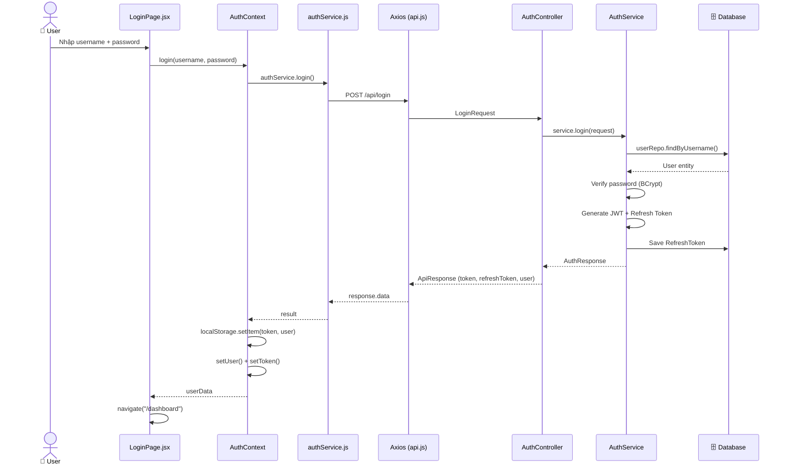
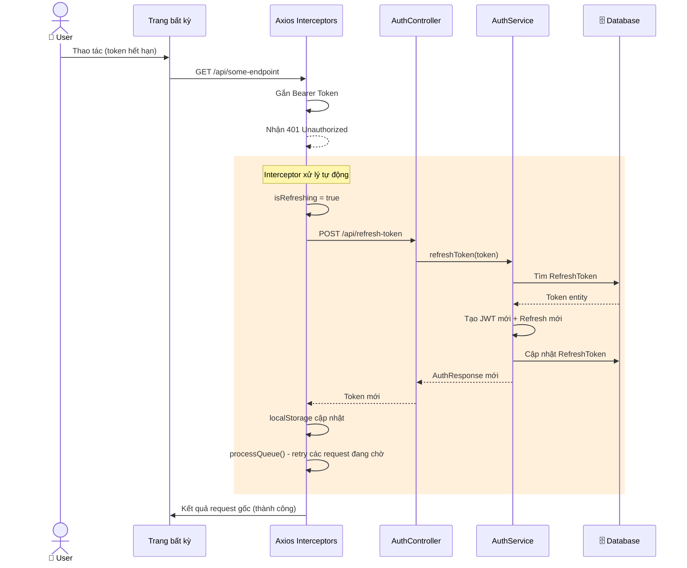
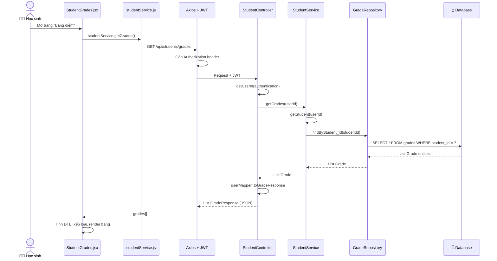
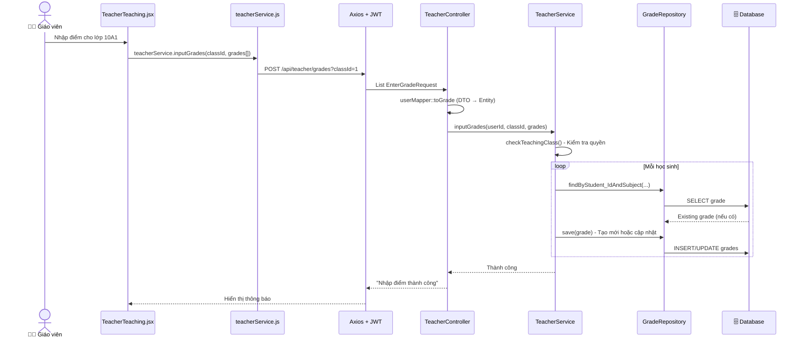
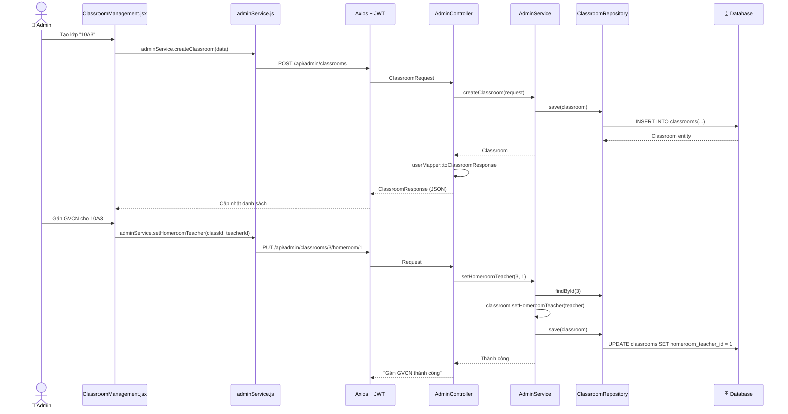
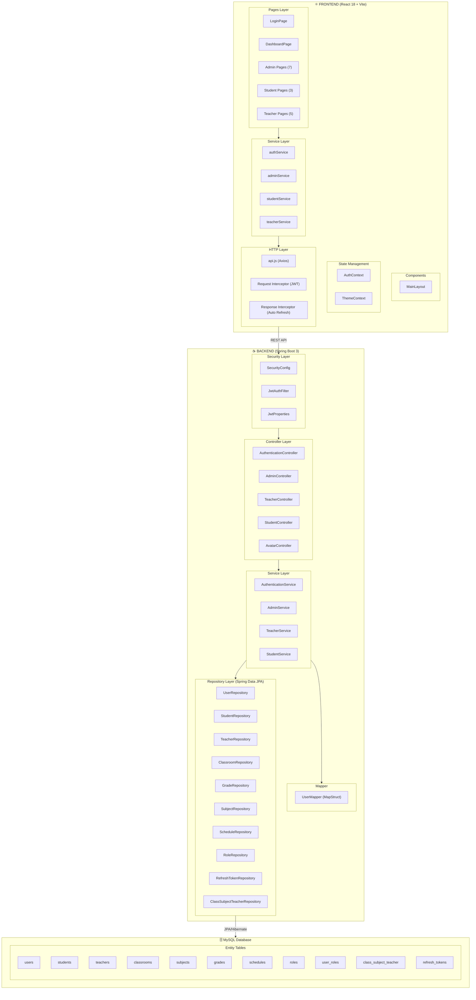
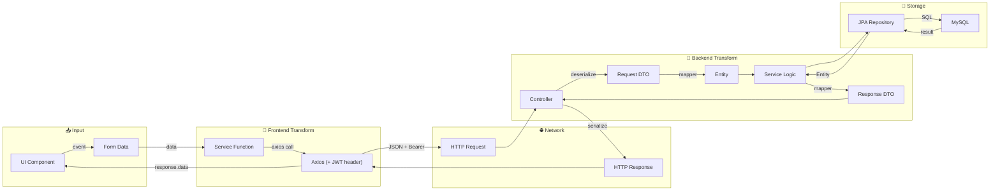

# Sơ đồ Luồng Hoạt Động: User → Frontend → Backend → DB

## 1. Tổng quan kiến trúc hệ thống

```mermaid
graph LR
    subgraph USER["👤 User (Browser)"]
        U[Người dùng]
    end

    subgraph FRONTEND["⚛️ Frontend - React + Vite"]
        direction TB
        Pages["Pages (19 trang)"]
        Context["Context (Auth + Theme)"]
        Services["Services (API Layer)"]
        Axios["Axios Interceptors"]
    end

    subgraph BACKEND["☕ Backend - Spring Boot"]
        direction TB
        Security["Security Filter (JWT)"]
        Controllers["Controllers (5)"]
        ServiceLayer["Services (3 + Auth)"]
        Mapper["UserMapper (DTO)"]
        Repos["Repositories (10 JPA)"]
    end

    subgraph DB["🗄️ Database - MySQL"]
        Tables["11 Tables"]
    end

    U -->|"Tương tác UI"| Pages
    Pages -->|"Gọi hàm"| Services
    Services -->|"HTTP + JWT"| Axios
    Axios -->|"REST API /api/*"| Security
    Security -->|"Xác thực"| Controllers
    Controllers -->|"Gọi logic"| ServiceLayer
    ServiceLayer -->|"Entity ↔ DTO"| Mapper
    ServiceLayer -->|"CRUD"| Repos
    Repos -->|"JPA/Hibernate"| Tables
    Tables -->|"Kết quả"| Repos
    Repos -->|"Entity"| ServiceLayer
    Controllers -->|"JSON Response"| Axios
    Axios -->|"Cập nhật State"| Pages
```

---

## 2. Luồng xác thực (Login Flow)

---

## 3. Luồng tự động làm mới Token (Auto Refresh)

---

## 4. Luồng theo vai trò (Role-based Flow)

### 4.1 Học sinh — Xem bảng điểm

### 4.2 Giáo viên — Nhập điểm

### 4.3 Admin — Quản lý lớp học

---

## 5. Kiến trúc tầng chi tiết

---

## 6. Bảng tóm tắt API Endpoints

| Controller | Method | Endpoint | Mô tả |
|---|---|---|---|
| **Auth** | POST | `/login` | Đăng nhập |
| | POST | `/register` | Đăng ký |
| | POST | `/refresh-token` | Làm mới token |
| | PUT | `/change-password` | Đổi mật khẩu |
| **Student** | GET | `/students/profile` | Xem hồ sơ |
| | PUT | `/students/profile` | Cập nhật hồ sơ |
| | GET | `/students/grades` | Xem bảng điểm |
| | GET | `/students/schedule` | Xem TKB |
| **Teacher** | GET | `/teacher/profile` | Xem hồ sơ |
| | GET | `/teacher/classrooms` | DS lớp dạy |
| | GET | `/teacher/schedule` | Lịch dạy |
| | POST | `/teacher/grades` | Nhập điểm |
| | GET | `/teacher/homeroom/grades` | Điểm lớp CN |
| **Admin** | GET/DELETE | `/admin/users` | Quản lý users |
| | GET/PUT/DELETE | `/admin/students` | Quản lý HS |
| | GET/PUT | `/admin/teachers` | Quản lý GV |
| | CRUD | `/admin/classrooms` | Quản lý lớp |
| | CRUD | `/admin/subjects` | Quản lý môn |
| | CRUD | `/admin/schedules` | Quản lý TKB |

---

## 7. Luồng dữ liệu tổng quát (Data Flow)

