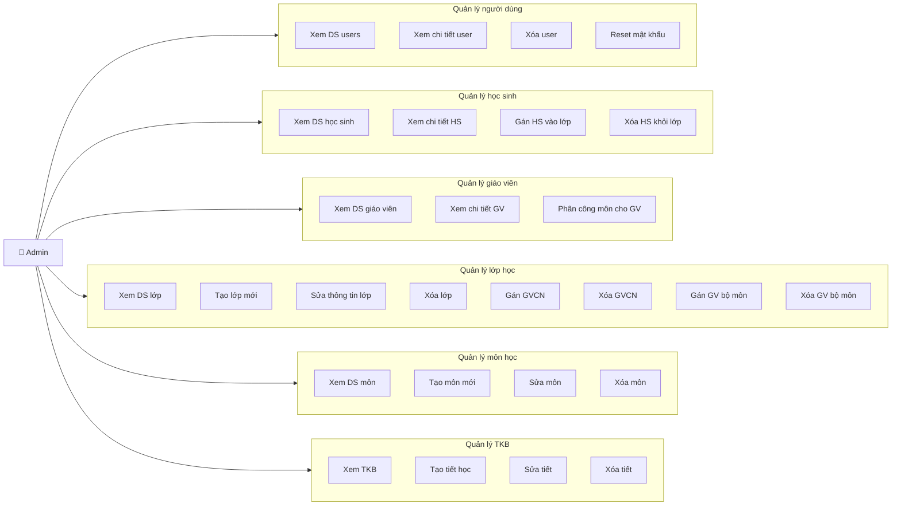
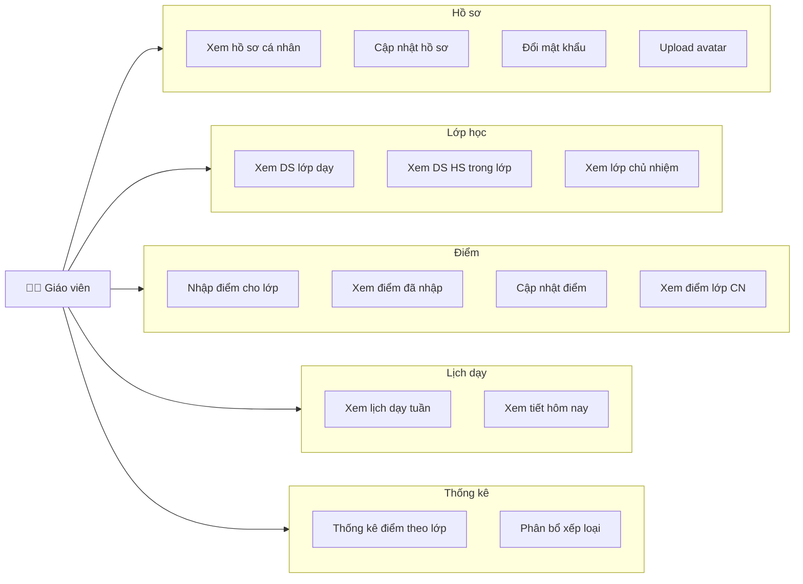
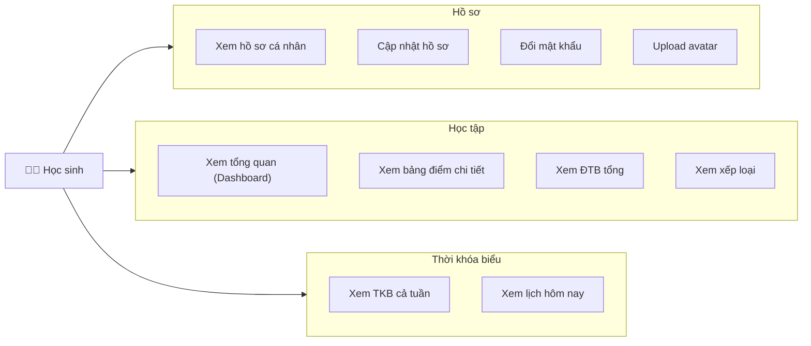
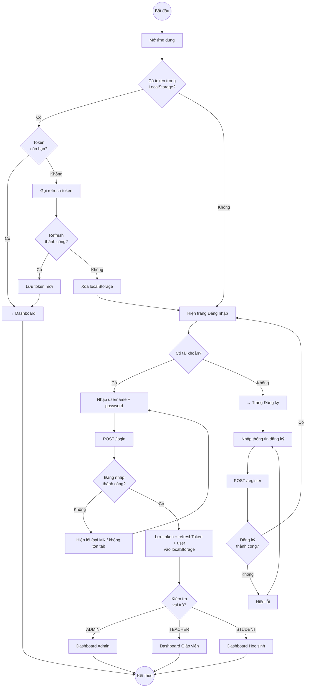
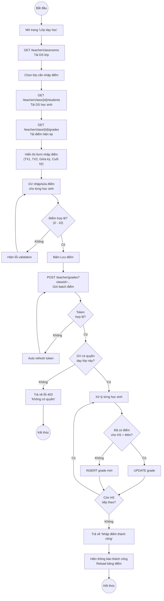
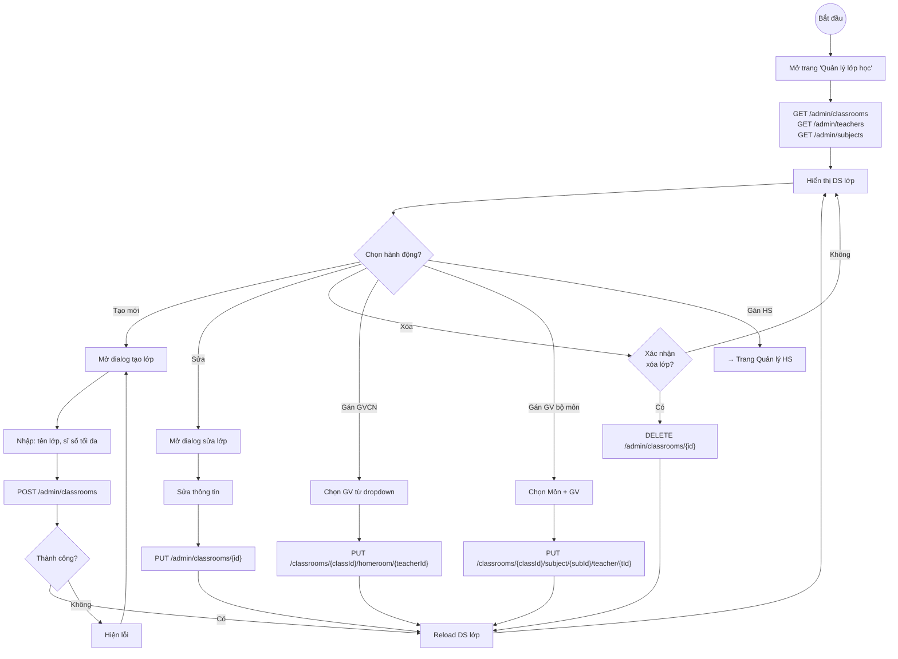
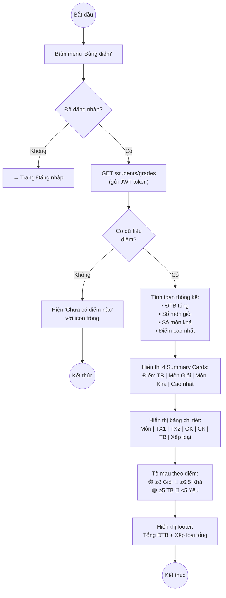
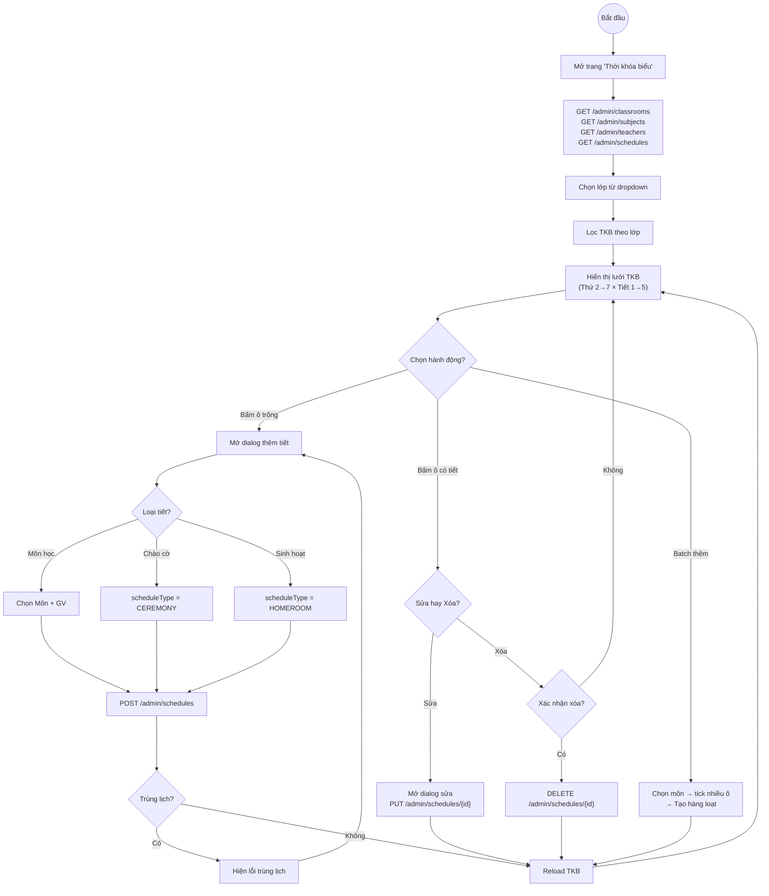

# Sơ đồ Use Case & Activity — Hệ thống QLHT

## 1. Sơ đồ Use Case tổng quan

```mermaid
graph TB
    subgraph System["🎓 Hệ thống Quản Lý Học Tập (QLHT)"]
        direction TB

        subgraph AuthUC["Xác thực"]
            UC_Login["Đăng nhập"]
            UC_Register["Đăng ký"]
            UC_ChangePW["Đổi mật khẩu"]
            UC_Avatar["Upload avatar"]
        end

        subgraph AdminUC["Quản trị"]
            UC_MngUser["Quản lý người dùng"]
            UC_MngStudent["Quản lý học sinh"]
            UC_MngTeacher["Quản lý giáo viên"]
            UC_MngClass["Quản lý lớp học"]
            UC_MngSubject["Quản lý môn học"]
            UC_MngSchedule["Quản lý TKB"]
            UC_Stats["Xem thống kê"]
        end

        subgraph TeacherUC["Giảng dạy"]
            UC_TProfile["Xem/sửa hồ sơ GV"]
            UC_Homeroom["Quản lý lớp chủ nhiệm"]
            UC_Teaching["Xem lớp giảng dạy"]
            UC_TSchedule["Xem lịch dạy"]
            UC_InputGrade["Nhập điểm"]
            UC_TStats["Xem thống kê GV"]
            UC_HRGrades["Xem điểm lớp CN"]
        end

        subgraph StudentUC["Học tập"]
            UC_SProfile["Xem/sửa hồ sơ HS"]
            UC_Grades["Xem bảng điểm"]
            UC_SSchedule["Xem thời khóa biểu"]
            UC_Dashboard["Xem tổng quan"]
        end
    end

    Admin["🔧 Admin"]
    Teacher["👩‍🏫 Giáo viên"]
    Student["👨‍🎓 Học sinh"]

    Admin --> UC_Login
    Admin --> UC_ChangePW
    Admin --> UC_Avatar
    Admin --> UC_MngUser
    Admin --> UC_MngStudent
    Admin --> UC_MngTeacher
    Admin --> UC_MngClass
    Admin --> UC_MngSubject
    Admin --> UC_MngSchedule
    Admin --> UC_Stats

    Teacher --> UC_Login
    Teacher --> UC_ChangePW
    Teacher --> UC_Avatar
    Teacher --> UC_TProfile
    Teacher --> UC_Homeroom
    Teacher --> UC_Teaching
    Teacher --> UC_TSchedule
    Teacher --> UC_InputGrade
    Teacher --> UC_TStats
    Teacher --> UC_HRGrades

    Student --> UC_Login
    Student --> UC_Register
    Student --> UC_ChangePW
    Student --> UC_Avatar
    Student --> UC_SProfile
    Student --> UC_Grades
    Student --> UC_SSchedule
    Student --> UC_Dashboard
```

---

## 2. Use Case chi tiết — Admin

## 3. Use Case chi tiết — Giáo viên

## 4. Use Case chi tiết — Học sinh

---

## 5. Sơ đồ Activity — Đăng nhập & Đăng ký

---

## 6. Sơ đồ Activity — Giáo viên nhập điểm

---

## 7. Sơ đồ Activity — Admin quản lý lớp học

---

## 8. Sơ đồ Activity — Học sinh xem bảng điểm

---

## 9. Sơ đồ Activity — Quản lý thời khóa biểu

